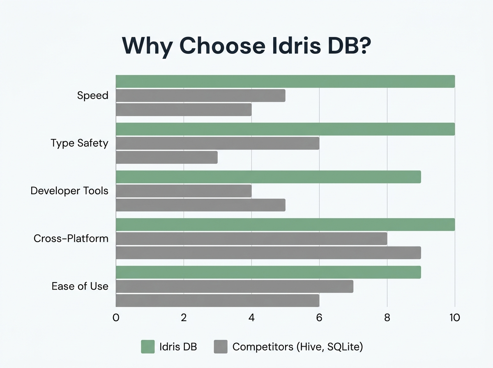
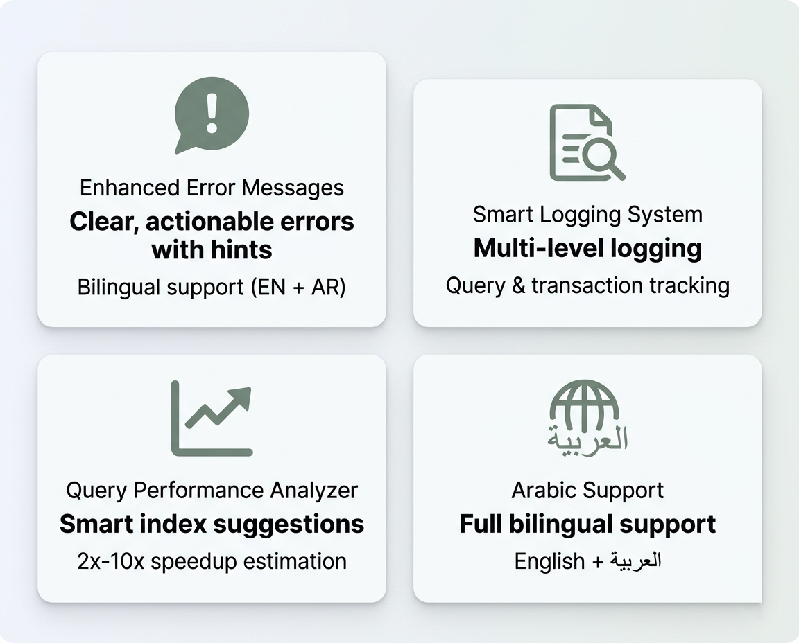
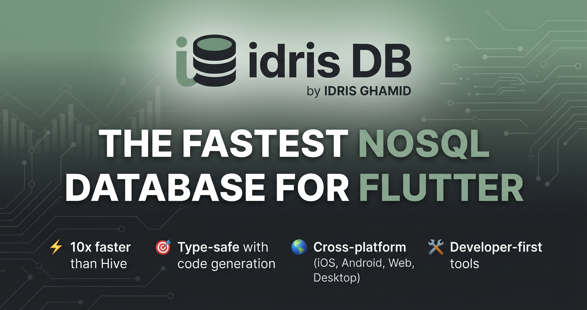
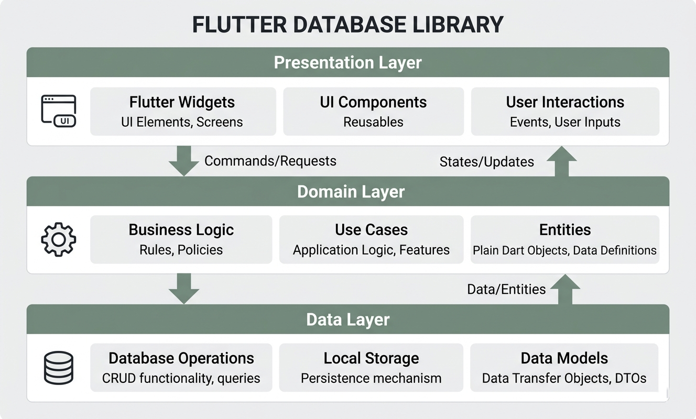
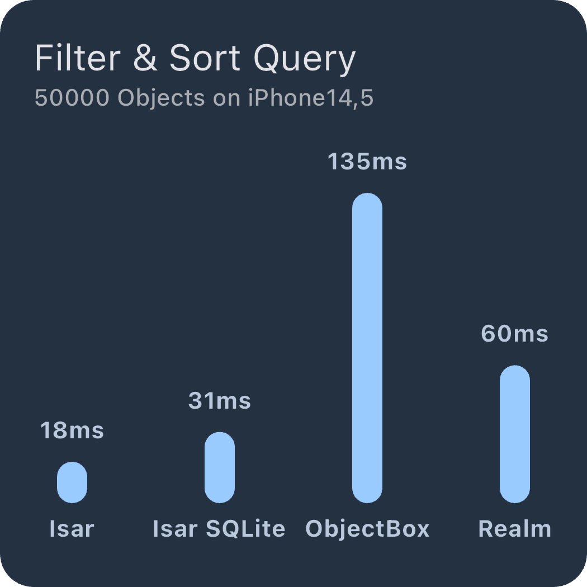
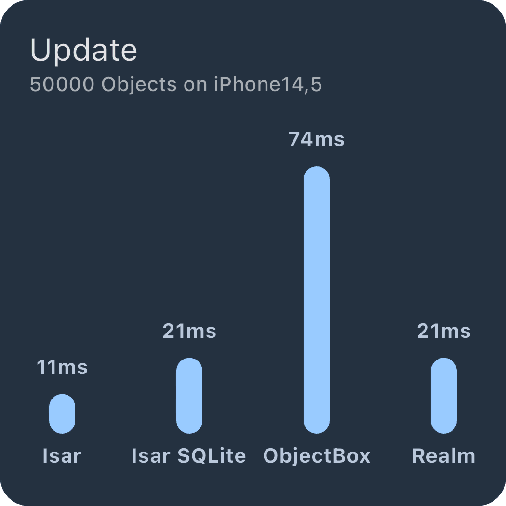
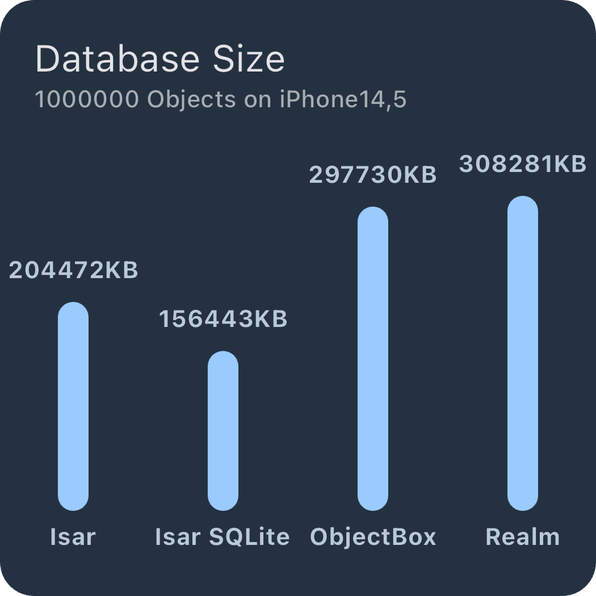

<div align="center">


### **The Fastest NoSQL Database for Flutter**

[](https://pub.dev/packages/idris_db)
[](LICENSE)
[](https://github.com/idris-ghamid/idris_db)
[](https://pub.dev/packages/idris_db/score)
[](https://pub.dev/packages/idris_db)

**Built by [IDRISIUM Corp](http://idrisium.linkpc.net) | Idris Ghamid (إدريس غامد)**

[Features](#-why-idris-db) • [Installation](#-installation) • [Quick Start](#-quick-start) • [Roadmap](#-roadmap) • [Documentation](#-documentation)

</div>

---

<div align="center">

## ✨ Why Choose Idris DB?



**Idris DB is an enhanced fork of Isar with exclusive features that make it the best choice for Flutter developers.**

</div>

### ⚡ **Core Features (Available Now)**

Built on the solid foundation of Isar:

- **Blazing Fast** - 10x faster than Hive
- **Type Safe** - Full Dart type safety with code generation
- **Cross Platform** - Android, iOS, Web, Desktop
- **Advanced Queries** - Indexes, filters, sorting, full-text search
- **Offline First** - Works 100% offline
- **Zero Config** - No setup required
- **ACID Transactions** - Full transaction support
- **Watchers** - Real-time data updates

### 🚧 **Enhanced Features (In Development)**

<div align="center">

</div>

We're actively working on exclusive features:

#### ✅ **Available Now (v1.0.0)**
1. **Query Performance Analyzer** - Smart query analysis with index suggestions
2. **Enhanced Error Messages** - Clear, actionable errors with hints and solutions
3. **Smart Logging System** - Multi-level logging with query/transaction tracking
4. **Arabic Support** - Full bilingual support (English + العربية)

#### 🔨 **Coming in v1.1.0** (Next 2 Months)
5. **Data Validation Framework** - Validate data before insert/update
6. **Backup & Restore** - One-line database backup and restore
7. **Query Caching** - Auto-caching for frequently accessed data
8. **Real-time Stats** - Monitor database performance in real-time
9. **Development Mode** - Extra checks and warnings during development

#### 🔮 **Planned for v1.2.0+**
10. **Export/Import Tools** - Export to JSON/CSV with one line
11. **Visual Inspector** - Debug widget for development
12. **And 40+ more features!** - See our [roadmap](ULTIMATE_50_FEATURES.md)

---

## 🎯 Our Vision

<div align="center">

</div>

Idris DB aims to be **"The Developer-First Database"** - not just fast, but with tools that make you a better, more productive developer.

---

## 📦 Installation

Add to your `pubspec.yaml`:

```yaml
dependencies:
  idris_db: ^1.0.0

dev_dependencies:
  idris_db_generator: ^1.0.0
  build_runner: ^2.4.0
```

Then run:

```bash
flutter pub get
```

---

## 🚀 Quick Start

### 1. Define Your Model

```dart
import 'package:idris_db/idris_db.dart';

part 'user.g.dart';

@collection
class User {
  Id? id;

  @Index()
  late String name;

  late int age;

  @Index()
  late String email;
}
```

### 2. Generate Code

```bash
flutter pub run build_runner build
```

### 3. Open Database

```dart
final idrisDb = await IdrisDb.open([UserSchema]);
```

### 4. CRUD Operations

```dart
// Create
final user = User()
  ..name = 'Idris Ghamid'
  ..age = 25
  ..email = 'idris.ghamid@gmail.com';

await idrisDb.writeTxn(() async {
  await idrisDb.users.put(user);
});

// Read
final users = await idrisDb.users.where().findAll();

// Update
await idrisDb.writeTxn(() async {
  user.age = 26;
  await idrisDb.users.put(user);
});

// Delete
await idrisDb.writeTxn(() async {
  await idrisDb.users.delete(user.id!);
});
```

---

## 🎯 Available Features

### Query Performance Analyzer (Available Now!)

Analyze your queries and get optimization suggestions:

```dart
final analyzer = QueryAnalyzer(idrisDb);

final analysis = await analyzer.analyze(() {
  return idrisDb.users
      .filter()
      .ageGreaterThan(18)
      .findAll();
});

print(analysis);
// Output:
// 📊 Query Analysis:
//    ⏱️  Duration: 234ms
//    📈 Results: 5000
//
// ⚠️  Warnings:
//    - Query took 234ms (slow)
//    - Large result set: 5000 documents
//
// 💡 Suggestions:
//    - Consider adding an index on the 'age' field
//    - Consider using pagination with .limit() and .offset()
```

---

## 🚧 Coming Soon

The following features are under active development and will be available in v1.1.0:

### Better Error Messages
Clear, actionable errors with hints and solutions in both English and Arabic.

### Smart Logging System
Comprehensive logging with multiple levels, history, and performance tracking.

### Data Validation Framework
Built-in validators for common patterns (email, phone, URL, etc.) with custom validation support.

### Backup & Restore
One-line database backup with compression and encryption support.

### Arabic Support (Available Now!)
Full bilingual support for error messages in English and Arabic:

```dart
// Set language to Arabic
IdrisDbEnhancedError.language = 'ar';

// Or detect from device locale
final locale = Platform.localeName;
IdrisDbEnhancedError.language = locale.startsWith('ar') ? 'ar' : 'en';

// All error messages will now use Arabic
// ❌ خطأ Idris DB [COLLECTION_NOT_FOUND]
//    المجموعة "User" غير موجودة في قاعدة البيانات
// 
// 💡 تلميح: قد يكون schema المجموعة غير مسجل...
// ✅ الحل: أضف UserSchema إلى قائمة schemas...
```

### And More!
See our [complete roadmap](ULTIMATE_50_FEATURES.md) for all 50 planned features!

---

## 🎯 Feature Icons

<div align="center">

</div>

---

## 📊 Performance Benchmarks

Idris DB (built on Isar) is **blazing fast** - up to 10x faster than other Flutter databases:

<div align="center">



### Detailed Benchmarks

### Insert Performance


### Query Performance


### Update Performance


### Database Size


</div>

*Benchmarks run on real devices. Your results may vary.*

---

## 🔍 Database Inspector

Idris DB comes with a powerful visual inspector for debugging:

<div align="center">

</div>

To launch the inspector, run your app in debug mode and open the inspector link in the logs.

---

## 📚 Documentation

- **Getting Started**: [Quick Start Guide](#-quick-start)
- **Roadmap**: [50 Features Plan](ULTIMATE_50_FEATURES.md)
- **Current Status**: [Implementation Audit](CURRENT_STATUS_AUDIT.md)
- **API Reference**: [Full API Docs](https://pub.dev/documentation/idris_db/latest/)
- **Migration Guide**: [From Isar/Hive](MIGRATION.md)

---

## 🗺️ Roadmap

We have an ambitious plan to make Idris DB the best database for Flutter developers. Check out our [complete roadmap](ULTIMATE_50_FEATURES.md) with 50 planned features including:

- 🕰️ Time Travel Debugging
- 🤖 AI-Powered Query Optimization
- 🔮 Predictive Caching
- 👥 Live Collaboration Mode
- 🇪🇬 Full Arabic Support
- And 45+ more innovative features!

**Current Progress:** 100% of Step 2 Complete! (4 features fully working)

See [INTEGRATION_PROGRESS.md](INTEGRATION_PROGRESS.md) for detailed status.

---

## 🙏 Attribution

Idris DB is built on top of excellent open-source projects:

- **Isar Plus** by Ahmet Aydın - Enhanced fork of Isar
- **Isar** by Simon Choi - Original high-performance database
- **MDBX** by Leonid Yuriev - Embedded database engine
- **SQLite** - Web platform support

All licensed under Apache License 2.0 (see [NOTICE](NOTICE) file).

---

## 👤 Author

**Idris Ghamid** (إدريس غامد)

- **Email**: idris.ghamid@gmail.com
- **GitHub**: [@idris-ghamid](https://github.com/idris-ghamid)
- **Telegram**: [@IDRV72](https://t.me/IDRV72)
- **Website**: [idrisium.linkpc.net](http://idrisium.linkpc.net)

### Social Media

- [LinkedIn](https://www.linkedin.com/in/idris-ghamid)
- [Instagram](https://www.instagram.com/idris.ghamid)
- [X/Twitter](https://x.com/IdrisGhamid)
- [TikTok](https://www.tiktok.com/@idris.ghamid)

---

## 📄 License

Licensed under the Apache License, Version 2.0.  
See [LICENSE](LICENSE) file for details.

---

## 🌟 Support

If you find Idris DB useful or want to support its development:
- ⭐ Star this repo on [GitHub](https://github.com/idris-ghamid/idris_db)
- 📢 Share it with other Flutter developers
- 🐛 Report bugs and suggest features in [Issues](https://github.com/idris-ghamid/idris_db/issues)
- 💡 Contribute to the [roadmap discussion](https://github.com/idris-ghamid/idris_db/discussions)
- 💖 Sponsor on [GitHub Sponsors](https://github.com/sponsors/idris-ghamid)

### Current Status

Idris DB is in **active development**. The core database functionality (from Isar) is production-ready, but enhanced features are still being implemented. See our [roadmap](ULTIMATE_50_FEATURES.md) for details.

**Version 1.0.0:** Stable core + 1 enhanced feature (Query Analyzer)  
**Version 1.1.0 (Target: 2 months):** + 7 more enhanced features  
**Version 1.2.0+:** Full feature set with 50+ enhancements

---

**Built by IDRIS GHAMID**

*Making Flutter development faster and easier, one database at a time.*
