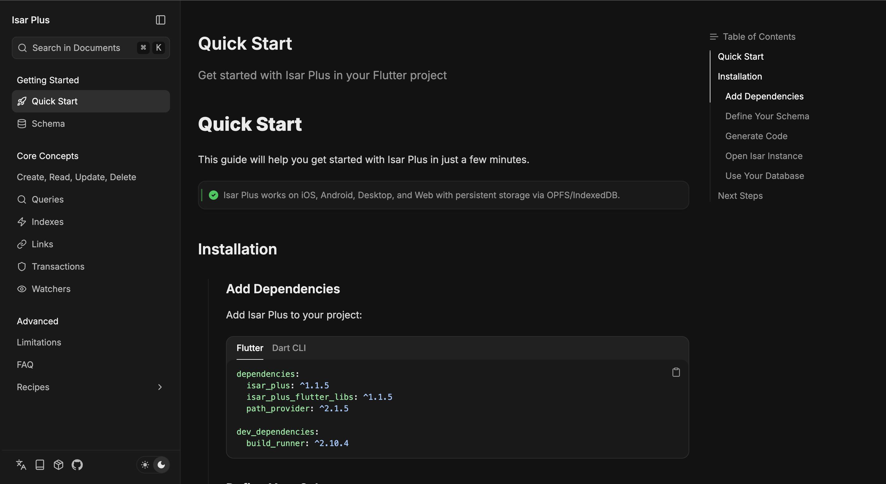
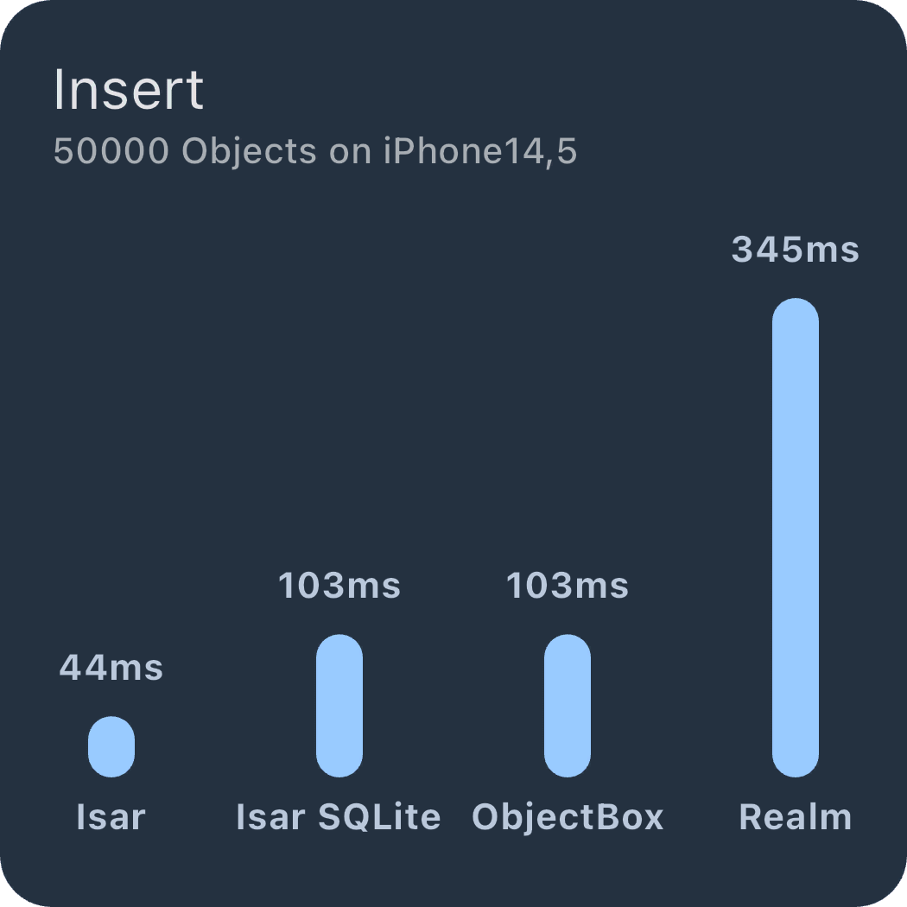

  
  <h1 align="center">IdrisDb Plus Database</h1>

  
  
  
  

  

---

## About IdrisDb Plus

IdrisDb Plus is an enhanced fork of the original [IdrisDb database](https://github.com/IdrisDb/IdrisDb) created by Simon Choi. This project builds upon the solid foundation of the original IdrisDb, adding new features, improvements, and ongoing maintenance.

### What's Different?

- ✨ **Enhanced Features**: Additional capabilities beyond the original IdrisDb
- 🌐 **Improved Web Support**: Better SQLite/WASM integration for Flutter Web
- 🔧 **Active Maintenance**: Regular updates and bug fixes
- 🚀 **Performance Optimizations**: Continuous improvements to speed and efficiency

## Features

- 💙 **Made for Flutter**. Easy to use, no config, no boilerplate
- 🚀 **Highly scalable** The sky is the limit (pun intended)
- 🍭 **Feature rich**. Composite & multi-entry indexes, query modifiers, JSON support etc.
- ⏱ **Asynchronous**. Parallel query operations & multi-isolate support by default
- 🦄 **Open source**. Everything is open source and free forever!
- ✨ **Enhanced**. Additional features and improvements over the original IdrisDb
- 🌐 **Persistent web storage**. IndexedDB for Flutter Web.

## Documentation

📚 **Comprehensive documentation is available at [idris-db-docs.vercel.app](https://idris-db-docs.vercel.app/)**

  

Join the [Telegram group](https://t.me/IDRISDBplus) for discussion and sneak peeks of new versions of the DB.

If you want to say thank you, star us on GitHub and like us on pub.dev 🙌💙

## IdrisDb Database Inspector

The IdrisDb Inspector allows you to inspect the IdrisDb instances & collections of your app in real-time. You can execute queries, edit properties, switch between instances and sort the data.

To launch the inspector, just run your IdrisDb app in debug mode and open the Inspector link in the logs.

## Benchmarks

Benchmarks only give a rough idea of the performance of a database but as you can see, IdrisDb NoSQL database is quite fast 😇

|  |  |
| ---------------------------------------------------------------------------------------------------------------- | --------------------------------------------------------------------------------------------------------------- |
|  |   |

If you are interested in more benchmarks or want to check how IdrisDb performs on your device you can run the [benchmarks](https://github.com/IdrisDb/IDRISDB_benchmark) yourself.

## Unit tests

If you want to use IdrisDb database in unit tests or Dart code, call `await IdrisDb.initializeIDRISDBCore(download: true)` before using IdrisDb in your tests.

IdrisDb NoSQL database will automatically download the correct binary for your platform. You can also pass a `libraries` map to adjust the download location for each platform.

Make sure to use `flutter test -j 1` to avoid tests running in parallel. This would break the automatic download.

## Contributors ✨

### IdrisDb Plus Contributors

Thanks to everyone contributing to IdrisDb Plus:

- [Ahmet Aydın](https://github.com/ahmtydn) - Project maintainer and lead developer

<!-- markdownlint-restore -->
<!-- prettier-ignore-end -->

<!-- ALL-CONTRIBUTORS-LIST:END -->

For a complete list of original IdrisDb contributors, please visit the [original repository](https://github.com/IdrisDb/IdrisDb/graphs/contributors).
